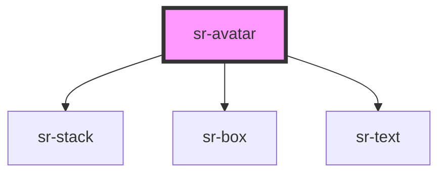

# sr-avatar

<!-- Auto Generated Below -->

## Properties

| Property   | Attribute  | Description                       | Type                                                                                         | Default     |
| ---------- | ---------- | --------------------------------- | -------------------------------------------------------------------------------------------- | ----------- |
| `image`    | `image`    | Get Image                         | `any`                                                                                        | `undefined` |
| `name`     | `name`     | Get Username                      | `any`                                                                                        | `undefined` |
| `size`     | `size`     | Indicate size of avatar           | `"large" \| "medium" \| "small"`                                                             | `'medium'`  |
| `username` | `username` | Get Username                      | `any`                                                                                        | `undefined` |
| `variant`  | `variant`  | Indicate variant status of avatar | `"default" \| "labeled" \| "listening" \| "offline" \| "online" \| "template" \| "verified"` | `undefined` |

## Dependencies

### Depends on

- [sr-stack](../../layouts/sr-stack)
- [sr-box](../../primitives/sr-box)
- [sr-text](../../primitives/sr-text)

### Graph

----------------------------------------------

*Built with [StencilJS](https://stenciljs.com/)*
