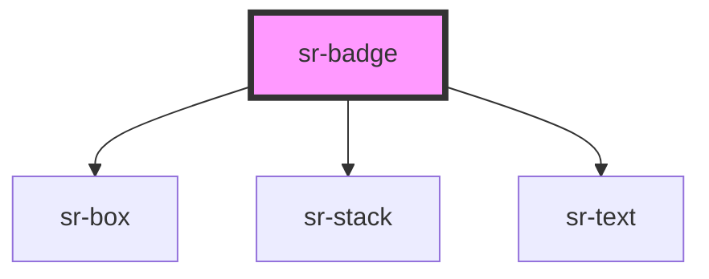

# sr-badge

<!-- Auto Generated Below -->

## Properties

| Property  | Attribute | Description                                       | Type                                                                                                           | Default     |
| --------- | --------- | ------------------------------------------------- | -------------------------------------------------------------------------------------------------------------- | ----------- |
| `text`    | `text`    | Indicate wording to show inside badge             | `string`                                                                                                       | `undefined` |
| `type`    | `type`    | Indicate type of Badge whether rounded or squared | `"rounded" \| "squared"`                                                                                       | `'rounded'` |
| `variant` | `variant` | Indicate the color of badge                       | `"aqua" \| "blue" \| "default" \| "lime" \| "orange" \| "pink" \| "purple" \| "red" \| "withIcon" \| "yellow"` | `'default'` |

## Dependencies

### Depends on

- [sr-box](../../primitives/sr-box)
- [sr-stack](../../layouts/sr-stack)
- [sr-text](../../primitives/sr-text)

### Graph

----------------------------------------------

*Built with [StencilJS](https://stenciljs.com/)*
