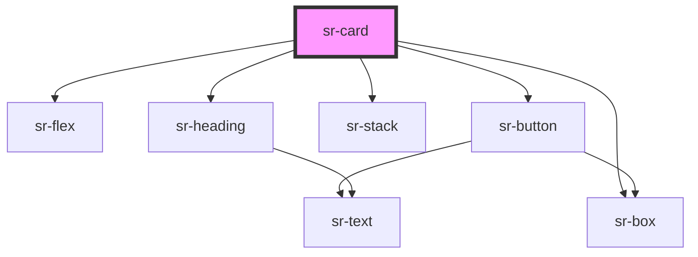

# sr-card

<!-- Auto Generated Below -->

## Overview

The `<sr-card>` component is used to group various pieces of content
into a container. Add a heading title with the `title` property, and introduce other content in the component's slot.

## Properties

| Property              | Attribute             | Description | Type      | Default     |
| --------------------- | --------------------- | ----------- | --------- | ----------- |
| `heading`             | `heading`             |             | `string`  | `''`        |
| `hideBorder`          | `hideborder`          |             | `boolean` | `false`     |
| `primaryButtonText`   | `primarybuttontext`   |             | `string`  | `undefined` |
| `secondaryButtonText` | `secondarybuttontext` |             | `string`  | `undefined` |

## Events

| Event                    | Description | Type               |
| ------------------------ | ----------- | ------------------ |
| `primaryButtonClicked`   |             | `CustomEvent<any>` |
| `secondaryButtonClicked` |             | `CustomEvent<any>` |

## Dependencies

### Depends on

- [sr-flex](../../layouts/sr-flex)
- [sr-button](../../form/sr-button)
- [sr-box](../../primitives/sr-box)
- [sr-stack](../../layouts/sr-stack)
- [sr-heading](../../typography/sr-heading)

### Graph

----------------------------------------------

*Built with [StencilJS](https://stenciljs.com/)*
