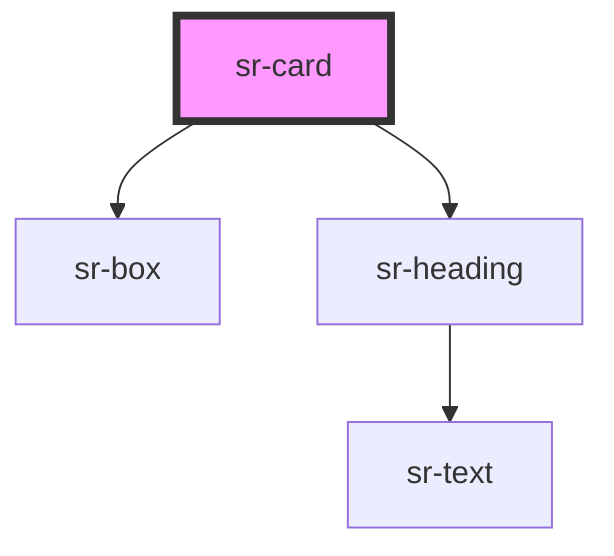

# sr-card

<!-- Auto Generated Below -->

## Overview

The `<sr-card>` component is used to group various pieces of content
into a container. Add a heading title with the `title` property, and introduce other content in the component's slot.

## Properties

| Property     | Attribute    | Description | Type      | Default |
| ------------ | ------------ | ----------- | --------- | ------- |
| `heading`    | `heading`    |             | `string`  | `''`    |
| `hideBorder` | `hideborder` |             | `boolean` | `false` |

## Dependencies

### Depends on

- [sr-box](../../primitives/sr-box)
- [sr-heading](../../typography/sr-heading)

### Graph

----------------------------------------------

*Built with [StencilJS](https://stenciljs.com/)*
