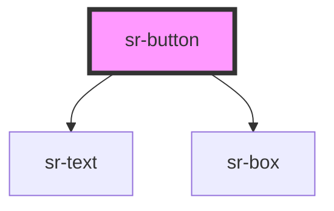

# hs-button

<!-- Auto Generated Below -->

## Overview

Button component with variable size and variants

## Properties

| Property     | Attribute    | Description     | Type                                                                                                                                                                          | Default                  |
| ------------ | ------------ | --------------- | ----------------------------------------------------------------------------------------------------------------------------------------------------------------------------- | ------------------------ |
| `isDisabled` | `isdisabled` |                 | `boolean`                                                                                                                                                                     | `false`                  |
| `text`       | `text`       |                 | `string`                                                                                                                                                                      | `'I’m a Re:Play Button'` |
| `variant`    | `variant`    | Type of button. | `"blackOutlinedRoundBtn" \| "blackOutlinedSquaredBtn" \| "blackRoundButton" \| "blackSquaredBtn" \| "outlinedRoundBtn" \| "outlinedSquaredBtn" \| "roundBtn" \| "squaredBtn"` | `'roundBtn'`             |

## Events

| Event     | Description                    | Type               |
| --------- | ------------------------------ | ------------------ |
| `clicked` | Emitted when button is clicked | `CustomEvent<any>` |

## Dependencies

### Depends on

- [sr-text](../../primitives/sr-text)
- [sr-box](../../primitives/sr-box)

### Graph

----------------------------------------------

*Built with [StencilJS](https://stenciljs.com/)*
