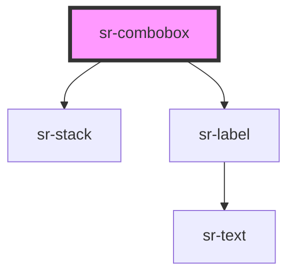

# sr-combobox

<!-- Auto Generated Below -->

## Overview

Combobox allows selection of a single value from the options specified in the transcluded slot.
This component expects that the HTML elements passed in the slot are of type `<option>`, which you can customize with the `disabled` and `selected` properties.
If no options have the `selected` property, the last option will be selected initially.

## Properties

| Property | Attribute | Description                                            | Type     | Default     |
| -------- | --------- | ------------------------------------------------------ | -------- | ----------- |
| `label`  | `label`   | Text string to add to a label to describe the combobox | `string` | `undefined` |

## Events

| Event      | Description                                                     | Type               |
| ---------- | --------------------------------------------------------------- | ------------------ |
| `selected` | Emitted when the one of the options in the combobox is selected | `CustomEvent<any>` |

## Dependencies

### Depends on

- [sr-stack](../../layouts/sr-stack)
- [sr-label](../sr-label)

### Graph

----------------------------------------------

*Built with [StencilJS](https://stenciljs.com/)*
