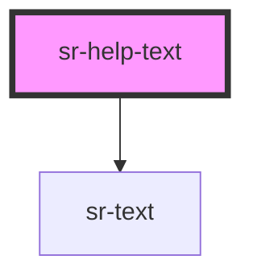

# sr-helptext

<!-- Auto Generated Below -->

## Overview

The `<sr-help-text>` component is a guideline that helps provide context regarding field inputs.

## Properties

| Property  | Attribute | Description       | Type                                | Default     |
| --------- | --------- | ----------------- | ----------------------------------- | ----------- |
| `variant` | `variant` | Helper Text State | `"default" \| "error" \| "success"` | `'default'` |

## Dependencies

### Depends on

- [sr-text](../../primitives/sr-text)

### Graph

----------------------------------------------

*Built with [StencilJS](https://stenciljs.com/)*
