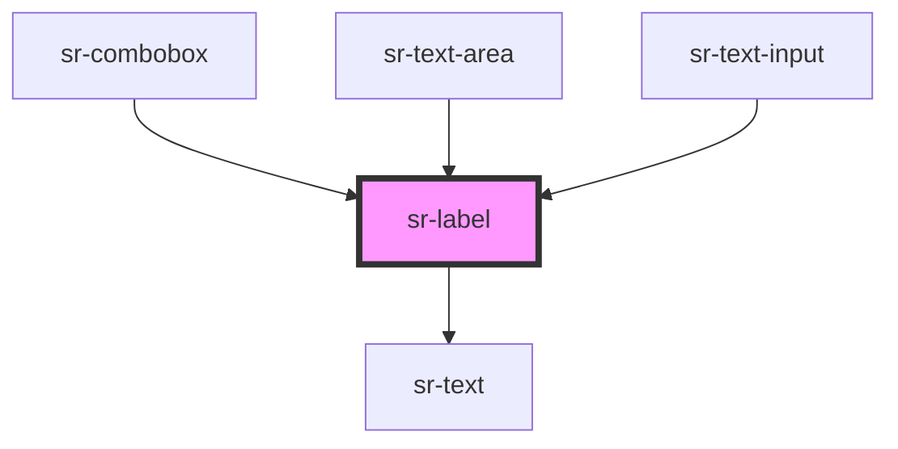

# sr-label

<!-- Auto Generated Below -->

## Overview

The `<sr-label>` component is a caption that helps provide context regarding field inputs.

## Properties

| Property  | Attribute | Description         | Type                                | Default     |
| --------- | --------- | ------------------- | ----------------------------------- | ----------- |
| `variant` | `variant` | Label variant state | `"default" \| "error" \| "success"` | `'default'` |

## Dependencies

### Used by

 - [sr-combobox](../sr-combobox)
 - [sr-text-area](../sr-text-area)
 - [sr-text-input](../sr-textinput)

### Depends on

- [sr-text](../../primitives/sr-text)

### Graph

----------------------------------------------

*Built with [StencilJS](https://stenciljs.com/)*
