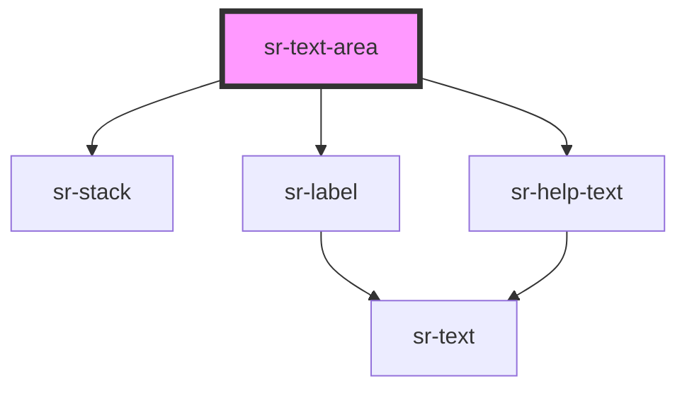

# sr-text-area

<!-- Auto Generated Below -->

## Properties

| Property      | Attribute     | Description                                 | Type     | Default              |
| ------------- | ------------- | ------------------------------------------- | -------- | -------------------- |
| `helperText`  | `helpertext`  | Indicate the purpose of the text field      | `string` | `undefined`          |
| `label`       | `label`       | Text label to place alongside the input     | `string` | `undefined`          |
| `placeholder` | `placeholder` | The text to display when the input is empty | `string` | `'Placeholder text'` |

## Events

| Event     | Description                            | Type               |
| --------- | -------------------------------------- | ------------------ |
| `_change` | Emitted when the input's value changes | `CustomEvent<any>` |

## Dependencies

### Depends on

- [sr-stack](../../layouts/sr-stack)
- [sr-label](../sr-label)
- [sr-help-text](../sr-helptext)

### Graph

----------------------------------------------

*Built with [StencilJS](https://stenciljs.com/)*
