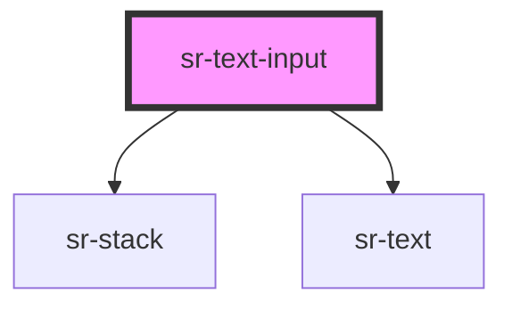

# sr-textinput

<!-- Auto Generated Below -->

## Overview

Text input that emits event on change

## Properties

| Property      | Attribute     | Description                                 | Type     | Default        |
| ------------- | ------------- | ------------------------------------------- | -------- | -------------- |
| `label`       | `label`       | Text label to place alongside the input     | `string` | `undefined`    |
| `placeholder` | `placeholder` | The text to display when the input is empty | `string` | `'Input text'` |

## Events

| Event     | Description                            | Type               |
| --------- | -------------------------------------- | ------------------ |
| `_change` | Emitted when the input's value changes | `CustomEvent<any>` |

## Dependencies

### Depends on

- [sr-stack](../../layouts/sr-stack)
- [sr-text](../../primitives/sr-text)

### Graph

----------------------------------------------

*Built with [StencilJS](https://stenciljs.com/)*
