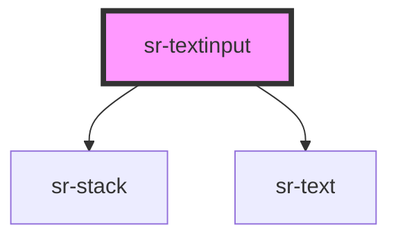

# sr-textinput

<!-- Auto Generated Below -->

## Overview

Text input component TODOJCS document

## Properties

| Property      | Attribute     | Description           | Type     | Default        |
| ------------- | ------------- | --------------------- | -------- | -------------- |
| `label`       | `label`       | TODOJCS describe prop | `string` | `undefined`    |
| `placeholder` | `placeholder` | TODOJCS describe prop | `string` | `'Input text'` |

## Dependencies

### Depends on

- [sr-stack](../../layouts/sr-stack)
- [sr-text](../../primitives/sr-text)

### Graph

----------------------------------------------

*Built with [StencilJS](https://stenciljs.com/)*
