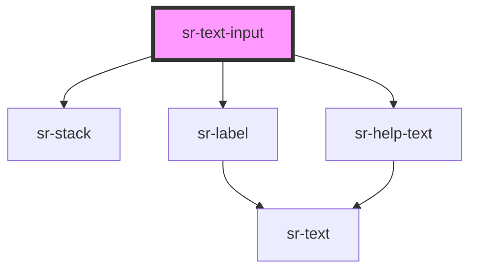

# sr-textinput

<!-- Auto Generated Below -->

## Overview

A <sr-text-input> component is an input component used to enter critical information required to use the service or user information.

## Properties

| Property      | Attribute     | Description                                         | Type                            | Default              |
| ------------- | ------------- | --------------------------------------------------- | ------------------------------- | -------------------- |
| `helperText`  | `helpertext`  | Indicate the purpose of the text field              | `string`                        | `undefined`          |
| `isDisabled`  | `isdisabled`  | Indicate whether this text field is disabled or not | `boolean`                       | `false`              |
| `isError`     | `iserror`     | Indicate Error state                                | `boolean`                       | `false`              |
| `isReadOnly`  | `isreadonly`  | Indicate whether this text field is readonly or not | `boolean`                       | `false`              |
| `isRequired`  | `isrequired`  | Indicate whether this text field is required or not | `boolean`                       | `false`              |
| `isSuccess`   | `issuccess`   | Indicate Success state                              | `boolean`                       | `false`              |
| `label`       | `label`       | Text label to place alongside the input             | `string`                        | `undefined`          |
| `placeholder` | `placeholder` | The text to display when the input is empty         | `string`                        | `'Placeholder text'` |
| `type`        | `type`        | Specify type of text field                          | `"email" \| "number" \| "text"` | `'text'`             |
| `value`       | `value`       | Specify current value in text field                 | `any`                           | `''`                 |
| `variant`     | `variant`     | Specify Button variant                              | `"rounded" \| "squared"`        | `'squared'`          |

## Events

| Event     | Description                            | Type               |
| --------- | -------------------------------------- | ------------------ |
| `_change` | Emitted when the input's value changes | `CustomEvent<any>` |

## Dependencies

### Depends on

- [sr-stack](../../layouts/sr-stack)
- [sr-label](../sr-label)
- [sr-help-text](../sr-helptext)

### Graph

----------------------------------------------

*Built with [StencilJS](https://stenciljs.com/)*
