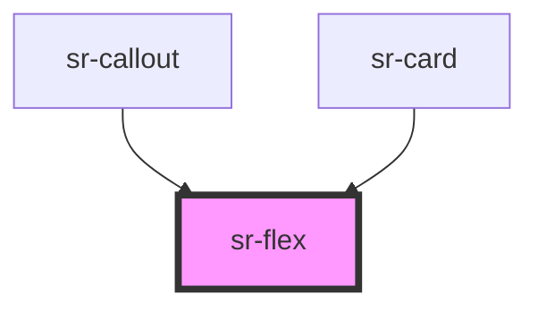

# sr-flex

<!-- Auto Generated Below -->

## Overview

The `<sr-flex>` component is a layout component manages layout of children components.
Its convenience for arranging direction and alignment of children inside the flex component.

## Properties

| Property     | Attribute    | Description                                                                                          | Type                                                                                                                         | Default        |
| ------------ | ------------ | ---------------------------------------------------------------------------------------------------- | ---------------------------------------------------------------------------------------------------------------------------- | -------------- |
| `direction`  | `direction`  | The `direction` property allows users to indicate what direction of children components or slots is. | `"horizontal" \| "horizontal-reverse" \| "vertical" \| "vertical-reverse"`                                                   | `'horizontal'` |
| `gap`        | `gap`        | The `gap` property adjusts spacing between children components inside flex                           | `"spacer-0" \| "spacer-1" \| "spacer-2" \| "spacer-3" \| "spacer-4" \| "spacer-5" \| "spacer-6" \| "spacer-7" \| "spacer-8"` | `undefined`    |
| `hAlignment` | `halignment` | The `hAlignment` property allows user to align children or slots on the main axis                    | `"around" \| "between" \| "center" \| "left" \| "right"`                                                                     | `'left'`       |
| `vAlignment` | `valignment` | The `vAlignment` property allows user to align children or slots on the cross axis                   | `"bottom" \| "center" \| "stretch" \| "top"`                                                                                 | `'top'`        |
| `wrap`       | `wrap`       | The `wrap` property allows children components wrap onto multiple lines                              | `boolean`                                                                                                                    | `false`        |

## Dependencies

### Used by

 - [sr-callout](../../text/sr-callout)
 - [sr-card](../../displays/sr-card)

### Graph

----------------------------------------------

*Built with [StencilJS](https://stenciljs.com/)*
