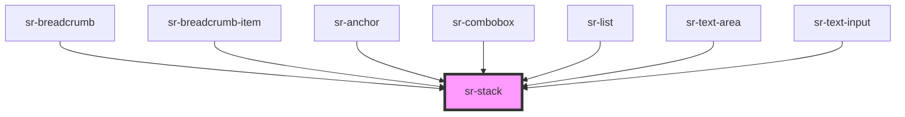

# sr-stack

<!-- Auto Generated Below -->

## Overview

The `<sr-stack>` component is a layout component manages layout of children
along the vertical or horizontal axis.

## Properties

| Property      | Attribute     | Description                                                                                                    | Type                                                                                                                         | Default      |
| ------------- | ------------- | -------------------------------------------------------------------------------------------------------------- | ---------------------------------------------------------------------------------------------------------------------------- | ------------ |
| `gap`         | `gap`         | The `gap` property sets the spacing in between elements, and has no effect in the leading or trailing element. | `"spacer-0" \| "spacer-1" \| "spacer-2" \| "spacer-3" \| "spacer-4" \| "spacer-5" \| "spacer-6" \| "spacer-7" \| "spacer-8"` | `undefined`  |
| `orientation` | `orientation` | The `orientation` property sets the direction for the flow, either vertical or horizontal.                     | `"horizontal" \| "vertical"`                                                                                                 | `'vertical'` |

## Dependencies

### Used by

 - [sr-breadcrumb](../../nav/sr-breadcrumb)
 - [sr-breadcrumb-item](../../nav/sr-breadcrumb-item)
 - [sr-combobox](../../form/sr-combobox)
 - [sr-list](../../text/sr-list)
 - [sr-text-area](../../form/sr-text-area)
 - [sr-text-input](../../form/sr-textinput)

### Graph

----------------------------------------------

*Built with [StencilJS](https://stenciljs.com/)*
