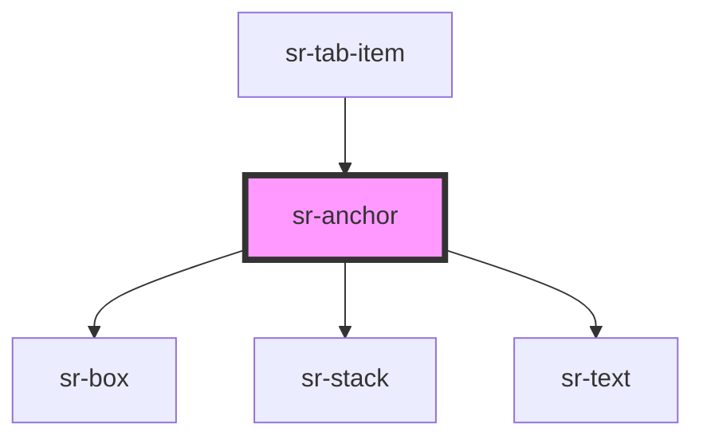

# sr-anchor

<!-- Auto Generated Below -->

## Overview

Anchor component to redirect to another URL.

## Properties

| Property       | Attribute         | Description                                                                                                                           | Type                      | Default     |
| -------------- | ----------------- | ------------------------------------------------------------------------------------------------------------------------------------- | ------------------------- | ----------- |
| `external`     | `external`        | Indicates whether the component points to an external URL. You define external, and it will be styled differently. Defaults to false. | `boolean`                 | `false`     |
| `href`         | `href`            | The URL to redirect to.                                                                                                               | `string`                  | `undefined` |
| `inActive`     | `inactive`        | Indicate inActive state of anchor Use this prop in tab component                                                                      | `boolean`                 | `false`     |
| `openInNewTab` | `open-in-new-tab` | Whether or not to open the URL in a new tab. Defaults to false.                                                                       | `boolean`                 | `false`     |
| `selected`     | `selected`        | Indicate active state of anchor Use this prop in tab component                                                                        | `boolean`                 | `false`     |
| `variant`      | `variant`         | Anchor variant                                                                                                                        | `"normal" \| "underline"` | `'normal'`  |

## Dependencies

### Used by

 - [sr-tab-item](../sr-tab-item)

### Depends on

- [sr-box](../../primitives/sr-box)
- [sr-stack](../../layouts/sr-stack)
- [sr-text](../../primitives/sr-text)

### Graph

----------------------------------------------

*Built with [StencilJS](https://stenciljs.com/)*
