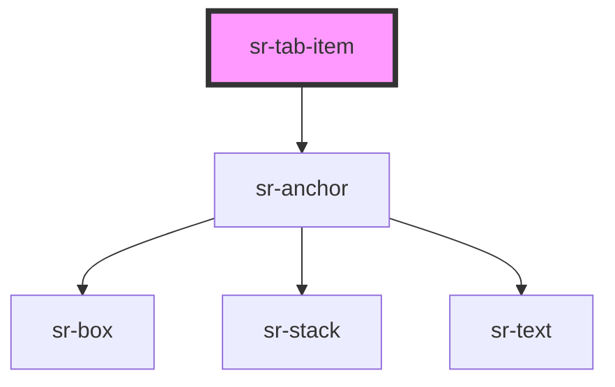

# sr-tab

<!-- Auto Generated Below -->

## Properties

| Property       | Attribute      | Description         | Type      | Default     |
| -------------- | -------------- | ------------------- | --------- | ----------- |
| `href`         | `href`         | Specify Tab content | `string`  | `undefined` |
| `inActive`     | `inactive`     | Inactive Tab        | `boolean` | `false`     |
| `name`         | `name`         | Specify Tab header  | `string`  | `undefined` |
| `selectedItem` | `selecteditem` | Selected Tab header | `string`  | `undefined` |

## Dependencies

### Depends on

- [sr-anchor](../sr-anchor)

### Graph

----------------------------------------------

*Built with [StencilJS](https://stenciljs.com/)*
