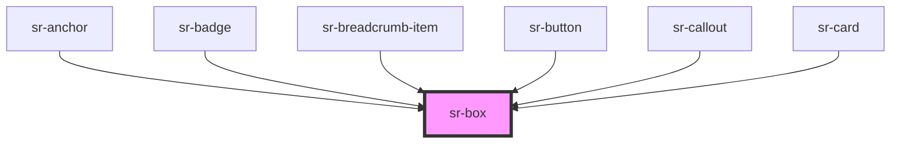

# sr-box

<!-- Auto Generated Below -->

## Overview

The `<sr-box>` component is a primitive component.
It is a simple wrapper component that can create other components such as card.

## Properties

| Property                | Attribute               | Description                                                           | Type                                                                                                                         | Default                           |
| ----------------------- | ----------------------- | --------------------------------------------------------------------- | ---------------------------------------------------------------------------------------------------------------------------- | --------------------------------- |
| `_activeBackground`     | `_activebackground`     | Control active background color                                       | `any`                                                                                                                        | `undefined`                       |
| `_activeBorderWidth`    | `_activeborderwidth`    | Control active border width                                           | `"medium" \| "thick" \| "thin"`                                                                                              | `undefined`                       |
| `_focusBackgroundColor` | `_focusbackgroundcolor` | Control focus background color                                        | `any`                                                                                                                        | `undefined`                       |
| `_focusBorderColor`     | `_focusbordercolor`     | Control focus border color                                            | `any`                                                                                                                        | `undefined`                       |
| `_focusBorderWidth`     | `_focusborderwidth`     | Control focus border width                                            | `"medium" \| "thick" \| "thin"`                                                                                              | `undefined`                       |
| `_hoverBackground`      | `_hoverbackground`      | Control hover color                                                   | `any`                                                                                                                        | `undefined`                       |
| `_hoverBorderColor`     | `_hoverbordercolor`     | Control hover border color width                                      | `any`                                                                                                                        | `undefined`                       |
| `_hoverBorderWidth`     | `_hoverborderwidth`     | Control hover border width                                            | `"medium" \| "thick" \| "thin"`                                                                                              | `undefined`                       |
| `as`                    | `as`                    | Specify wrapper HTML element                                          | `"article" \| "div" \| "section" \| "span"`                                                                                  | `'div'`                           |
| `backgroundColor`       | `backgroundcolor`       | Specify background fill inside box component                          | `any`                                                                                                                        | `ColorFoundationNeutralPureWhite` |
| `borderColor`           | `bordercolor`           | Specify border color                                                  | `any`                                                                                                                        | `ColorFoundationNeutralPureBlack` |
| `borderRadius`          | `borderradius`          | Specify border radius                                                 | `any`                                                                                                                        | `'medium'`                        |
| `borderWidth`           | `borderwidth`           | Specify border width                                                  | `"medium" \| "thick" \| "thin"`                                                                                              | `'thick'`                         |
| `boxShadow`             | `boxshadow`             | Control shadow effects around box component                           | `"level0" \| "level1" \| "level2" \| "level3" \| "level4"`                                                                   | `undefined`                       |
| `color`                 | `color`                 | Specify text color inside box component                               | `any`                                                                                                                        | `ColorFoundationNeutralBlack400`  |
| `height`                | `height`                | Specify height of box component                                       | `"large" \| "medium" \| "small"`                                                                                             | `undefined`                       |
| `isBorder`              | `isborder`              | Enable or disable border around box component                         | `boolean`                                                                                                                    | `false`                           |
| `isClickable`           | `isclickable`           | Control clickable state                                               | `boolean`                                                                                                                    | `false`                           |
| `isDisabled`            | `isdisabled`            | Control disable state                                                 | `boolean`                                                                                                                    | `false`                           |
| `margin`                | `margin`                | Control amount of white space around the box component itself.        | `"spacer-0" \| "spacer-1" \| "spacer-2" \| "spacer-3" \| "spacer-4" \| "spacer-5" \| "spacer-6" \| "spacer-7" \| "spacer-8"` | `'spacer-1'`                      |
| `marginBottom`          | `marginbottom`          | Define amount of space at bottom side only.                           | `"spacer-0" \| "spacer-1" \| "spacer-2" \| "spacer-3" \| "spacer-4" \| "spacer-5" \| "spacer-6" \| "spacer-7" \| "spacer-8"` | `undefined`                       |
| `marginLeft`            | `marginleft`            | Define amount of space at left side only.                             | `"spacer-0" \| "spacer-1" \| "spacer-2" \| "spacer-3" \| "spacer-4" \| "spacer-5" \| "spacer-6" \| "spacer-7" \| "spacer-8"` | `undefined`                       |
| `marginRight`           | `marginright`           | Define amount of space at right side only.                            | `"spacer-0" \| "spacer-1" \| "spacer-2" \| "spacer-3" \| "spacer-4" \| "spacer-5" \| "spacer-6" \| "spacer-7" \| "spacer-8"` | `undefined`                       |
| `marginTop`             | `margintop`             | Define amount of space at top side only.                              | `"spacer-0" \| "spacer-1" \| "spacer-2" \| "spacer-3" \| "spacer-4" \| "spacer-5" \| "spacer-6" \| "spacer-7" \| "spacer-8"` | `undefined`                       |
| `maxHeight`             | `maxheight`             | Specify max height of box component                                   | `number`                                                                                                                     | `undefined`                       |
| `maxWidth`              | `maxwidth`              | Specify max width of box component                                    | `number`                                                                                                                     | `undefined`                       |
| `minHeight`             | `minheight`             | Specify min height of box component                                   | `number`                                                                                                                     | `undefined`                       |
| `minWidth`              | `minwidth`              | Specify min width of box component                                    | `number`                                                                                                                     | `undefined`                       |
| `padding`               | `padding`               | Control amount of white space around child components inside of a box | `"spacer-0" \| "spacer-1" \| "spacer-2" \| "spacer-3" \| "spacer-4" \| "spacer-5" \| "spacer-6" \| "spacer-7" \| "spacer-8"` | `'spacer-1'`                      |
| `paddingBottom`         | `paddingbottom`         | Define amount of white space at bottom side only                      | `"spacer-0" \| "spacer-1" \| "spacer-2" \| "spacer-3" \| "spacer-4" \| "spacer-5" \| "spacer-6" \| "spacer-7" \| "spacer-8"` | `undefined`                       |
| `paddingLeft`           | `paddingleft`           | Define amount of white space at left side only                        | `"spacer-0" \| "spacer-1" \| "spacer-2" \| "spacer-3" \| "spacer-4" \| "spacer-5" \| "spacer-6" \| "spacer-7" \| "spacer-8"` | `undefined`                       |
| `paddingRight`          | `paddingright`          | Define amount of white space at right side only                       | `"spacer-0" \| "spacer-1" \| "spacer-2" \| "spacer-3" \| "spacer-4" \| "spacer-5" \| "spacer-6" \| "spacer-7" \| "spacer-8"` | `undefined`                       |
| `paddingTop`            | `paddingtop`            | Define amount of white space at top side only                         | `"spacer-0" \| "spacer-1" \| "spacer-2" \| "spacer-3" \| "spacer-4" \| "spacer-5" \| "spacer-6" \| "spacer-7" \| "spacer-8"` | `undefined`                       |
| `width`                 | `width`                 | Specify width of box component                                        | `"fit-content" \| "large" \| "medium" \| "small"`                                                                            | `'fit-content'`                   |

## Dependencies

### Used by

 - [sr-anchor](../../nav/sr-anchor)
 - [sr-badge](../../displays/sr-badge)
 - [sr-breadcrumb-item](../../nav/sr-breadcrumb-item)
 - [sr-button](../../form/sr-button)
 - [sr-callout](../../text/sr-callout)
 - [sr-card](../../displays/sr-card)

### Graph

----------------------------------------------

*Built with [StencilJS](https://stenciljs.com/)*
