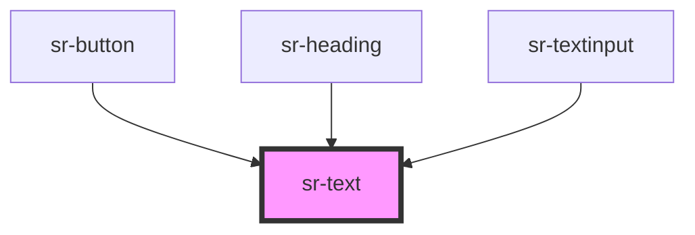

# sr-text

<!-- Auto Generated Below -->

## Properties

| Property        | Attribute       | Description                                                           | Type                                                                                                               | Default     |
| --------------- | --------------- | --------------------------------------------------------------------- | ------------------------------------------------------------------------------------------------------------------ | ----------- |
| `as`            | `as`            | Specify wrapper HTML element                                          | `"blockquote" \| "caption" \| "div" \| "endnote" \| "h1" \| "h2" \| "h3" \| "h4" \| "h5" \| "h6" \| "p" \| "span"` | `'div'`     |
| `color`         | `color`         | Specify font color                                                    | `"black" \| "white"`                                                                                               | `undefined` |
| `fontSize`      | `fontsize`      | Specify font size                                                     | `number`                                                                                                           | `undefined` |
| `fontWeight`    | `fontweight`    | Control font weight                                                   | `"bold" \| "extraBold" \| "regular"`                                                                               | `'regular'` |
| `letterSpacing` | `letterspacing` | Define the space between characters in a text                         | `number`                                                                                                           | `undefined` |
| `lineHeight`    | `lineheight`    | Define the height of a line                                           | `number`                                                                                                           | `undefined` |
| `margin`        | `margin`        | Control amount of white space around the box component itself.        | `number`                                                                                                           | `0`         |
| `marginBottom`  | `marginbottom`  | Define amount of space at bottom side only.                           | `number`                                                                                                           | `0`         |
| `marginLeft`    | `marginleft`    | Define amount of space at left side only.                             | `number`                                                                                                           | `0`         |
| `marginRight`   | `marginright`   | Define amount of space at right side only.                            | `number`                                                                                                           | `0`         |
| `marginTop`     | `margintop`     | Define amount of space at top side only.                              | `number`                                                                                                           | `0`         |
| `padding`       | `padding`       | Control amount of white space around child components inside of a box | `number`                                                                                                           | `0`         |
| `paddingBottom` | `paddingbottom` | Define amount of white space at bottom side only                      | `number`                                                                                                           | `0`         |
| `paddingLeft`   | `paddingleft`   | Define amount of white space at left side only                        | `number`                                                                                                           | `0`         |
| `paddingRight`  | `paddingright`  | Define amount of white space at right side only                       | `number`                                                                                                           | `0`         |
| `paddingTop`    | `paddingtop`    | Define amount of white space at top side only                         | `number`                                                                                                           | `0`         |

## Dependencies

### Used by

 - [sr-button](../../form/sr-button)
 - [sr-heading](../../typography/sr-heading)
 - [sr-textinput](../../form/sr-textinput)

### Graph

----------------------------------------------

*Built with [StencilJS](https://stenciljs.com/)*
