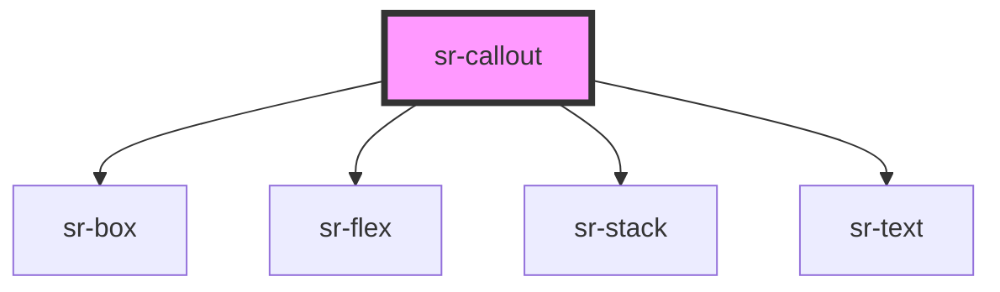

# sr-callout

<!-- Auto Generated Below -->

## Overview

Callout components provide a way to draw the user's attention.

## Properties

| Property     | Attribute    | Description                                                                                                | Type                                                                           | Default         |
| ------------ | ------------ | ---------------------------------------------------------------------------------------------------------- | ------------------------------------------------------------------------------ | --------------- |
| `content`    | `content`    | The detail to display in the topmost part of the callout                                                   | `string`                                                                       | `undefined`     |
| `headerText` | `headertext` | The title to display in the topmost part of the callout                                                    | `string`                                                                       | `undefined`     |
| `type`       | `type`       | Indicates the importance of the callout. The default is 'informative', for the lowest level of importance. | `"critical" \| "informative" \| "new" \| "success" \| "template" \| "warning"` | `'informative'` |

## Dependencies

### Depends on

- [sr-box](../../primitives/sr-box)
- [sr-flex](../../layouts/sr-flex)
- [sr-stack](../../layouts/sr-stack)
- [sr-text](../../primitives/sr-text)

### Graph

----------------------------------------------

*Built with [StencilJS](https://stenciljs.com/)*
