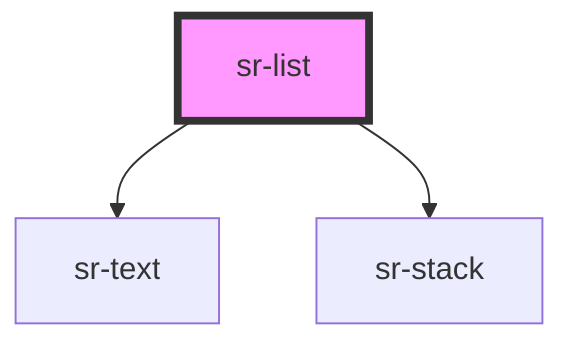

# sr-list

<!-- Auto Generated Below -->

## Overview

List element for showing text, separated into list elements
This component expects that the HTML elements passed in the slot are of type <li>

## Properties

| Property  | Attribute | Description                                                         | Type      | Default |
| --------- | --------- | ------------------------------------------------------------------- | --------- | ------- |
| `ordered` | `ordered` | Opt for an ordered list `<ol>` or `<ul>` if false. False by default | `boolean` | `false` |

## Dependencies

### Depends on

- [sr-text](../../primitives/sr-text)
- [sr-stack](../../layouts/sr-stack)

### Graph

----------------------------------------------

*Built with [StencilJS](https://stenciljs.com/)*
