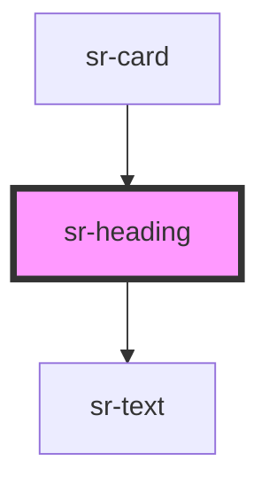

# hs-header

<!-- Auto Generated Below -->

## Overview

Heading component, with support for heading elements, and custom alignment.
Its convenience for pointing out document sections makes it one of the most consumed components in our Design System.

## Properties

| Property    | Attribute   | Description                                                                                 | Type                                                                   | Default     |
| ----------- | ----------- | ------------------------------------------------------------------------------------------- | ---------------------------------------------------------------------- | ----------- |
| `color`     | `color`     | Specify text color                                                                          | `any`                                                                  | `undefined` |
| `level`     | `level`     | The `level` property allows users to indicate what header hierarchy this element is.        | `"1" \| "2" \| "3" \| "4" \| "5" \| "6" \| 1 \| 2 \| 3 \| 4 \| 5 \| 6` | `1`         |
| `textAlign` | `textalign` | Provides support for implementing horizontal alignment to the text contained in the header. | `"center" \| "justify" \| "left" \| "right"`                           | `'left'`    |

## Dependencies

### Used by

 - [sr-card](../../displays/sr-card)

### Depends on

- [sr-text](../../primitives/sr-text)

### Graph

----------------------------------------------

*Built with [StencilJS](https://stenciljs.com/)*
