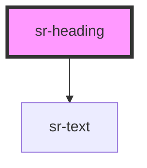

# hs-header

<!-- Auto Generated Below -->

## Overview

Heading component, with support for heading elements spanning from `h1` to `h6`, and custom alignment.
Its convenience for pointing out document sections makes it one of the most consumed components in our Design System.

## Properties

| Property    | Attribute   | Description                                                                                                                 | Type                                                                                                                                                    | Default   |
| ----------- | ----------- | --------------------------------------------------------------------------------------------------------------------------- | ------------------------------------------------------------------------------------------------------------------------------------------------------- | --------- |
| `color`     | `color`     | Specify text color                                                                                                          | `"black" \| "white"`                                                                                                                                    | `'black'` |
| `level`     | `level`     | The `level` property allows users to indicate what header hierarchy this element is. It must take a number from `1` to `6`. | `"h1" \| "h2-bold" \| "h2-regular" \| "h3-bold" \| "h3-regular" \| "h4-bold" \| "h4-regular" \| "h5-bold" \| "h5-regular" \| "h6-bold" \| "h6-regular"` | `'h1'`    |
| `textAlign` | `textalign` | Provides support for implementing horizontal alignment to the text contained in the header.                                 | `"center" \| "justify" \| "left" \| "right"`                                                                                                            | `'left'`  |

## Dependencies

### Depends on

- [sr-text](../../primitives/sr-text)

### Graph

----------------------------------------------

*Built with [StencilJS](https://stenciljs.com/)*
